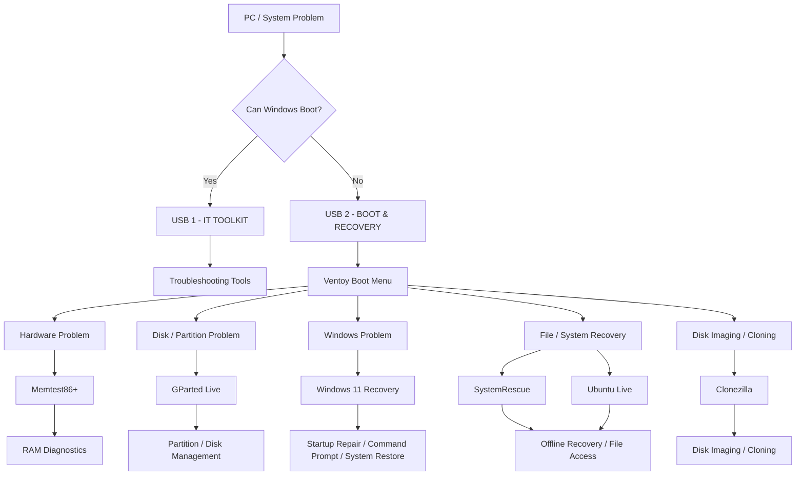

# Disaster Recovery Workflow

```mermaid
flowchart TD
    A[PC / System Problem] --> B{Can Windows Boot?}
    B -->|Yes| C[USB 1 - IT TOOLKIT]
    B -->|No| D[USB 2 - BOOT & RECOVERY]
    C --> E[Troubleshooting Tools]
    D --> F[Ventoy Boot Menu]
    F --> G[Hardware Problem]
    F --> H[Disk / Partition Problem]
    F --> I[Windows Problem]
    F --> J[File / System Recovery]
    F --> K[Disk Imaging / Cloning]
    G --> L[Memtest86+]
    L --> M[RAM Diagnostics]
    H --> N[GParted Live]
    N --> O[Partition / Disk Management]
    I --> P[Windows 11 Recovery]
    P --> Q[Startup Repair / Command Prompt / System Restore]
    J --> R[SystemRescue]
    J --> S[Ubuntu Live]
    R --> T[Offline Recovery / File Access]
    S --> T
    K --> U[Clonezilla]
    U --> V[Disk Imaging / Cloning]
```
