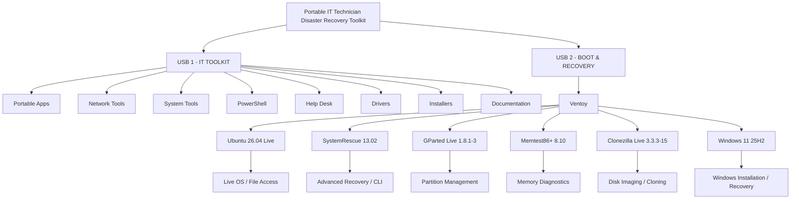

# Toolkit Architecture

```mermaid
flowchart TD
    A[Portable IT Technician Disaster Recovery Toolkit]
    A --> B[USB 1 - IT TOOLKIT]
    A --> C[USB 2 - BOOT & RECOVERY]
    B --> B1[Portable Apps]
    B --> B2[Network Tools]
    B --> B3[System Tools]
    B --> B4[PowerShell]
    B --> B5[Help Desk]
    B --> B6[Drivers]
    B --> B7[Installers]
    B --> B8[Documentation]
    C --> D[Ventoy]
    D --> C1[Ubuntu 26.04 Live]
    D --> C2[SystemRescue 13.02]
    D --> C3[GParted Live 1.8.1-3]
    D --> C4[Memtest86+ 8.10]
    D --> C5[Clonezilla Live 3.3.3-15]
    D --> C6[Windows 11 25H2]
    C1 --> E1[Live OS / File Access]
    C2 --> E2[Advanced Recovery / CLI]
    C3 --> E3[Partition Management]
    C4 --> E4[Memory Diagnostics]
    C5 --> E5[Disk Imaging / Cloning]
    C6 --> E6[Windows Installation / Recovery]
```
