# Portable IT Technician Disaster Recovery Toolkit

## Overview

This project demonstrates the creation, organization, and testing of a two-USB portable IT support and disaster recovery toolkit designed for help desk, technical support, system recovery, hardware diagnostics, disk management, and operating system troubleshooting.

The toolkit separates everyday technician utilities from bootable recovery environments.

- **USB 1 — IT-TOOLKIT:** Used when the operating system is functional and portable troubleshooting tools are needed.
- **USB 2 — BOOT-RECOVERY:** Used when a computer cannot boot normally or requires offline diagnostics, recovery, imaging, or operating system repair.

---

## USB 1 — IT-TOOLKIT

USB 1 provides portable resources for troubleshooting systems that can still boot normally.

### Included Resources

- PowerShell automation scripts
- Network troubleshooting tools
- System utilities
- Portable applications
- Software installers
- Driver resources
- Help desk documentation
- Recovery utilities
- Technician reference material

### Primary Uses

- Network troubleshooting
- System diagnostics
- Help desk support
- PowerShell automation
- Software installation
- Driver installation
- General technician troubleshooting

---

## USB 2 — BOOT-RECOVERY

USB 2 is a Ventoy-based multiboot recovery drive designed for offline troubleshooting and disaster recovery.

### Boot Platform

- **Ventoy 1.1.17**

### Bootable Environments

| Tool | Version | Purpose | Boot Tested |
|---|---|---|---|
| Ubuntu Live | 26.04 Desktop AMD64 | Live operating system and file access | Yes |
| SystemRescue | 13.02 AMD64 | Advanced offline system recovery | Yes |
| GParted Live | 1.8.1-3 AMD64 | Disk and partition management | Yes |
| Memtest86+ | 8.10 | RAM diagnostics | Yes — 1 pass, 0 errors |
| Clonezilla Live | 3.3.3-15 AMD64 | Disk imaging and cloning | Yes |
| Windows 11 | 25H2 x64 | Windows installation and recovery | Yes |

### USB Organization

```text
Ventoy/
├── Diagnostics/
│   └── Memtest86Plus-8.10.iso
├── Linux/
│   └── ubuntu-26.04-desktop-amd64.iso
├── Recovery/
│   ├── clonezilla-live-3.3.3-15-amd64.iso
│   ├── gparted-live-1.8.1-3-amd64.iso
│   └── systemrescue-13.02-amd64.iso
└── Windows/
    └── Win11_25H2_English_x64_v2.iso
```

---

## Recovery Capabilities

The toolkit can be used for:

- Boot failure troubleshooting
- Windows recovery
- Linux live troubleshooting
- File recovery
- Disk and partition management
- Memory diagnostics
- Disk imaging and cloning
- Network troubleshooting
- Operating system installation
- Offline system diagnostics

---

## Validation Results

The boot and recovery environments were tested using a VirtualBox recovery test environment.

### Tests Completed

- Ventoy multiboot menu successfully loaded
- Ubuntu Live successfully reached the desktop
- SystemRescue successfully booted and diagnostic commands were tested
- GParted Live successfully loaded for disk and partition inspection
- Memtest86+ completed **1 pass with 0 errors**
- Windows 11 Recovery Environment successfully loaded
- Windows Advanced Recovery Options were accessed
- Windows Command Prompt was successfully accessed
- DiskPart successfully detected the virtual disk
- Clonezilla successfully reached its disk imaging and cloning modes

> **Safety:** No destructive formatting, partitioning, cloning, recovery, or operating system installation operations were performed during validation.

---

## Recovery Workflow

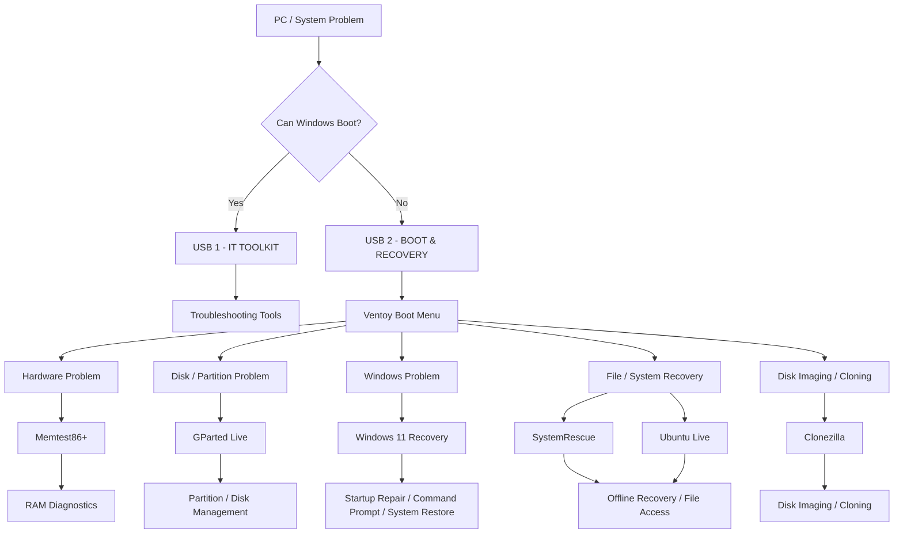

---

## Toolkit Architecture

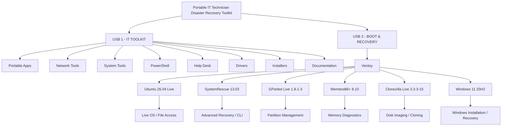

---

## Lab Environment

- macOS host computer
- Oracle VirtualBox
- Ubuntu virtual machine
- Windows virtual machines
- Physical USB storage
- Ventoy multiboot platform
- Windows Recovery Environment
- Linux live environments

---

## Troubleshooting & Recovery Scenarios

The project includes practical technician scenarios covering:

1. Network troubleshooting
2. Windows recovery
3. File recovery
4. Disk partitioning
5. Hardware diagnostics
6. Disk imaging and cloning

---

## Portfolio Evidence

This repository contains:

- Lab documentation
- USB inventories
- Troubleshooting scenarios
- Recovery scenarios
- Architecture diagrams
- Recovery workflow diagram
- Screenshots demonstrating successful testing

### Screenshot Evidence

Testing evidence includes screenshots of:

- Ventoy multiboot environment
- Ubuntu Live
- SystemRescue
- GParted Live
- Memtest86+
- Windows Recovery Environment
- Windows Advanced Recovery Options
- Windows DiskPart
- Clonezilla boot environment
- Clonezilla imaging modes
- Final USB ISO inventory

---

## Documentation

Detailed project documentation is available in the `Documentation` directory:

- `01-Lab-Overview.md`
- `02-IT-Toolkit-USB.md`
- `03-Boot-Rescue-USB.md`
- `04-Tools-Used.md`
- `05-Lessons-Learned.md`

USB inventories and supporting resources are available in the `Resources` directory.

---

## Repository Structure

```text
Portable IT Technician Disaster Recovery Toolkit/
├── README.md
├── Documentation/
│   ├── 01-Lab-Overview.md
│   ├── 02-IT-Toolkit-USB.md
│   ├── 03-Boot-Rescue-USB.md
│   ├── 04-Tools-Used.md
│   └── 05-Lessons-Learned.md
├── Resources/
│   ├── USB-1-IT-TOOLKIT/
│   └── USB-2-BOOT-RECOVERY/
├── Screenshots/
│   ├── USB-1-IT-TOOLKIT/
│   └── USB-2-BOOT-RECOVERY/
├── Scenarios/
└── Diagrams/
    ├── Recovery-Workflow/
    └── Toolkit-Architecture/
```

---

## Skills Demonstrated

- IT troubleshooting
- Help desk support
- Technical support
- Windows support
- Linux administration
- macOS administration
- Virtualization
- Bootable media creation
- Ventoy multiboot configuration
- Windows Recovery Environment
- Disaster recovery planning
- Hardware diagnostics
- RAM testing
- Disk and partition management
- Disk imaging and cloning
- File recovery concepts
- PowerShell
- Network troubleshooting
- Command-line troubleshooting
- Technical documentation
- IT toolkit organization

## Validation Screenshots

### USB 1 — IT Toolkit Structure

The IT-TOOLKIT USB organizes portable technician resources into dedicated categories for PowerShell, networking, system utilities, installers, drivers, recovery, documentation, help desk resources, and portable applications.

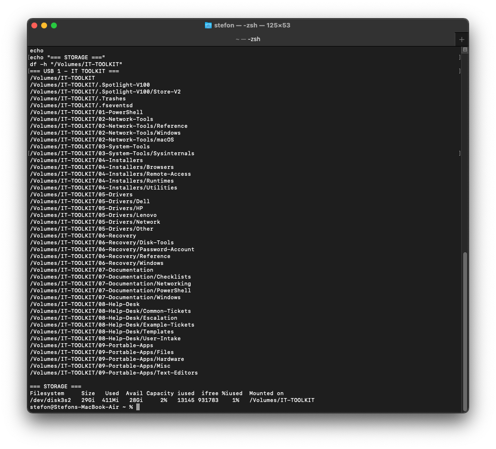

### USB 1 — Toolkit Inventory

The toolkit contains practical technician resources including PowerShell automation scripts, PuTTY, Nmap, Wireshark, Sysinternals, browser installers, recovery references, troubleshooting documentation, and help desk ticket templates.

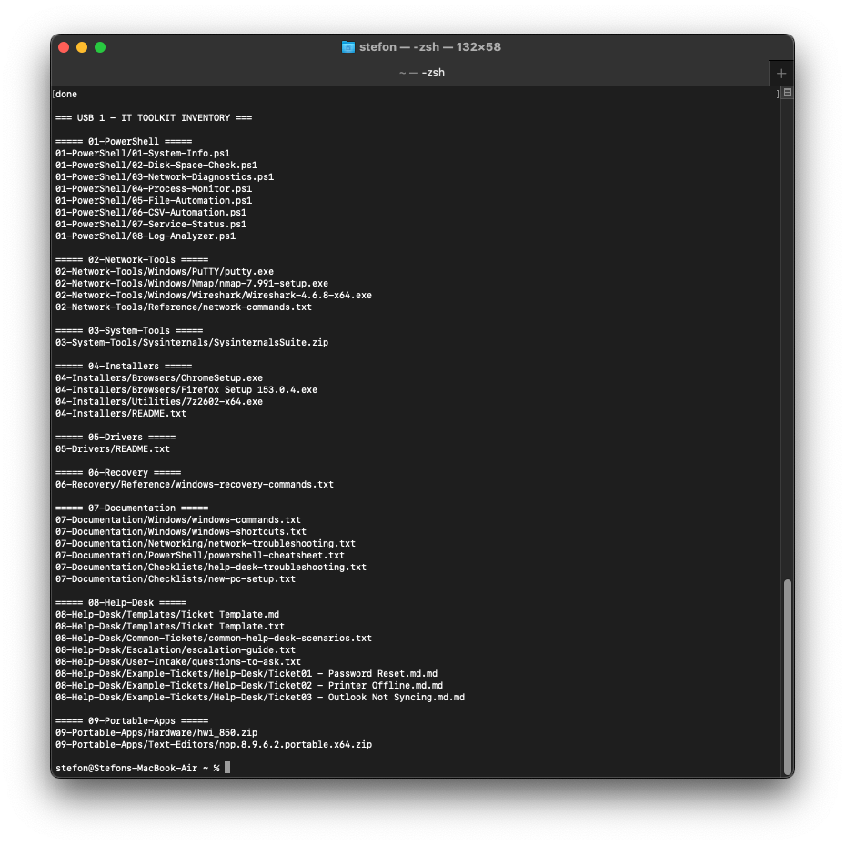

### Ventoy Multiboot Menu

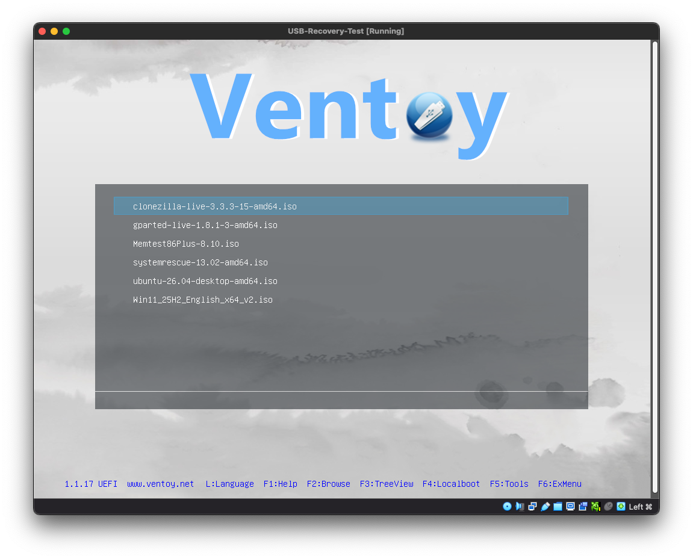

### Ubuntu Live Environment

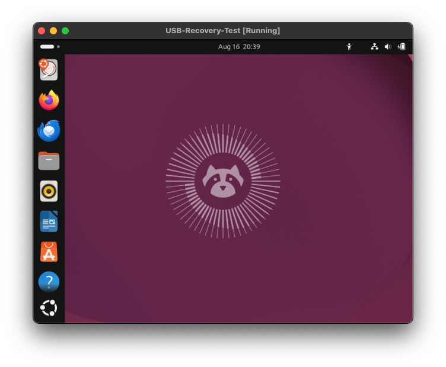

### SystemRescue Diagnostics

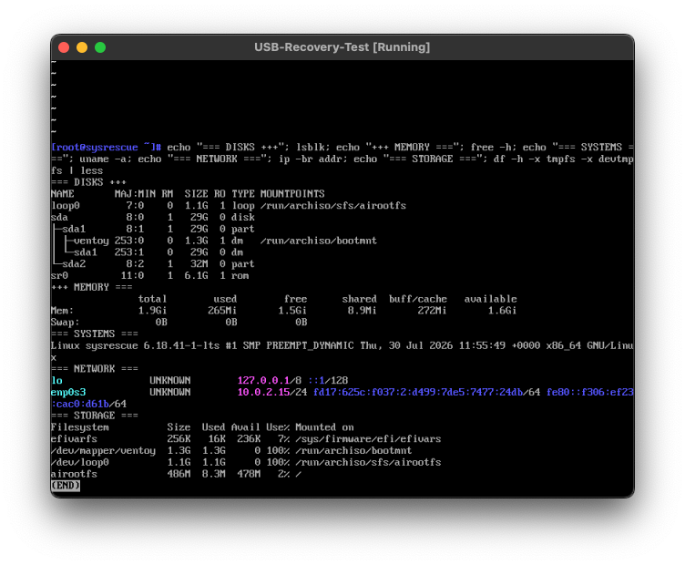

### GParted Live

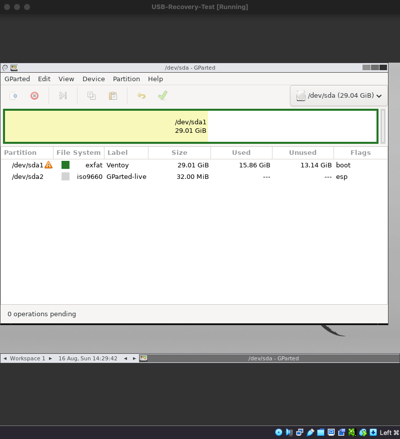

### Memtest86+ Validation

Memtest86+ completed one full pass with zero detected errors.

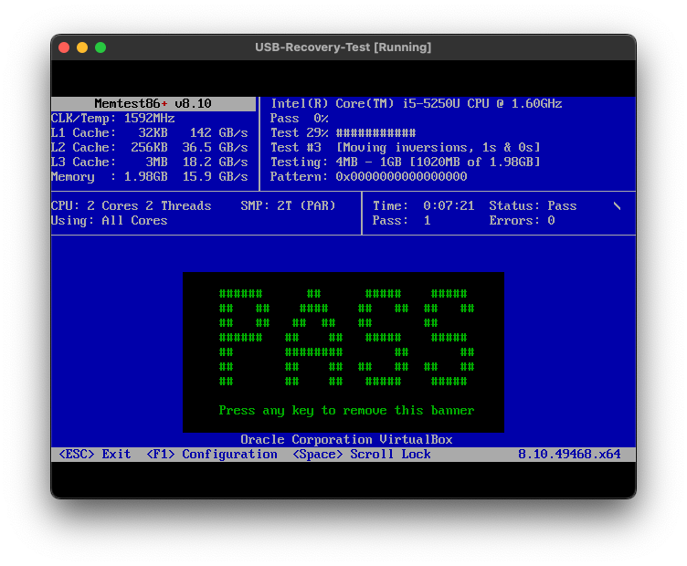

### Windows Recovery Environment

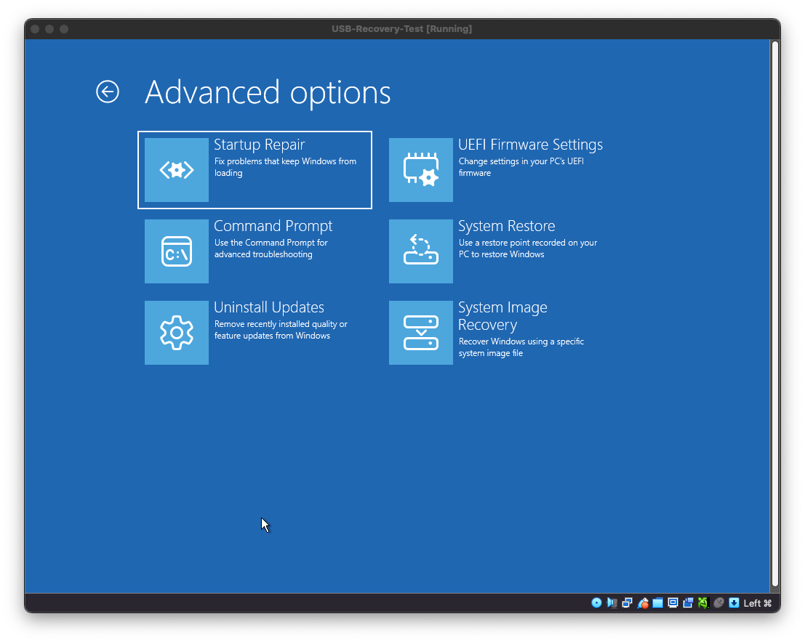

### Windows Disk Diagnostics

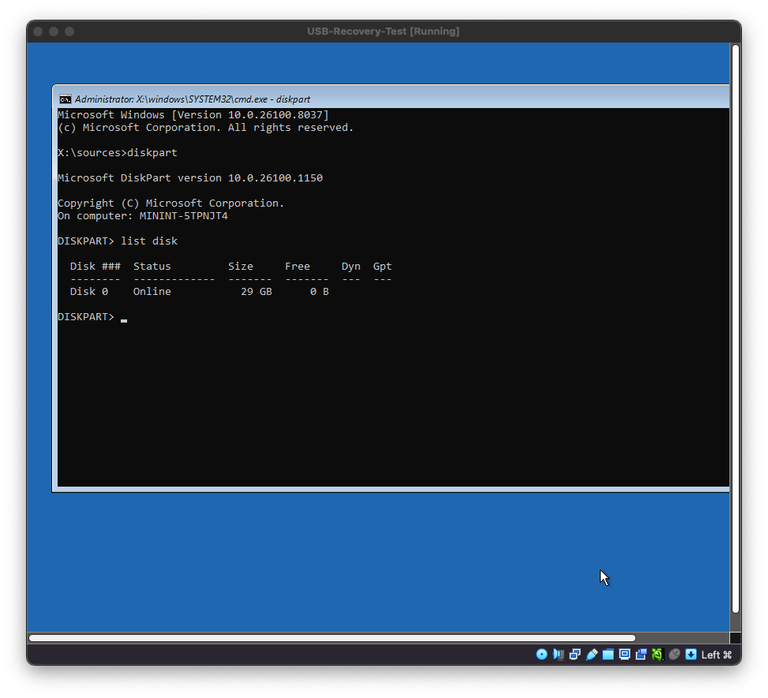

### Clonezilla Imaging Modes

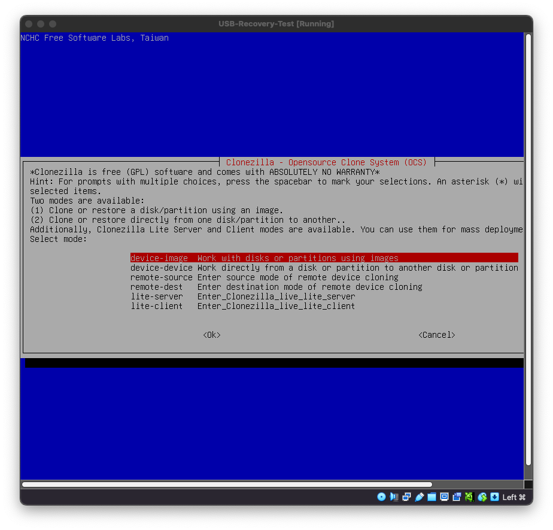

### Final Boot-Recovery USB Inventory

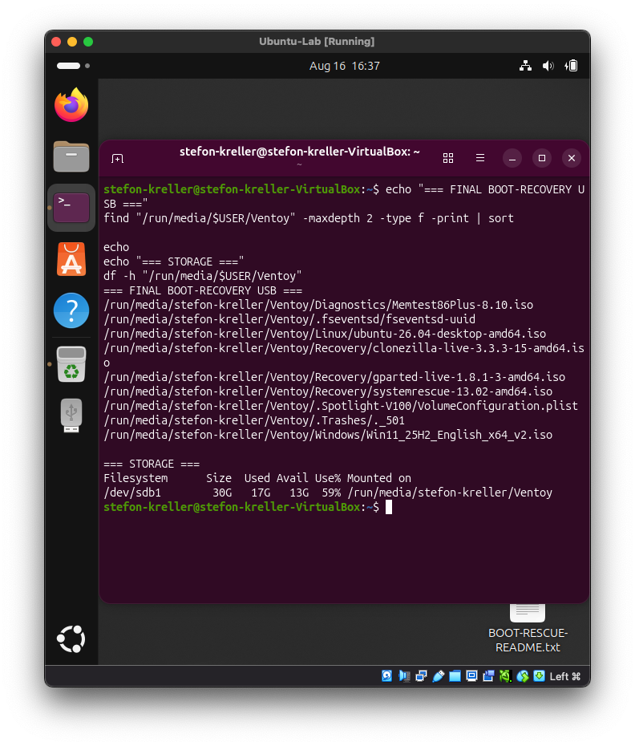

---

## Project Outcome

This project produced a reusable two-USB technician toolkit capable of supporting troubleshooting from initial diagnosis through offline system recovery.

The project demonstrates practical experience selecting, organizing, booting, testing, and documenting technician tools and recovery environments applicable to **Help Desk, Desktop Support, Technical Support, and IT Support** roles.